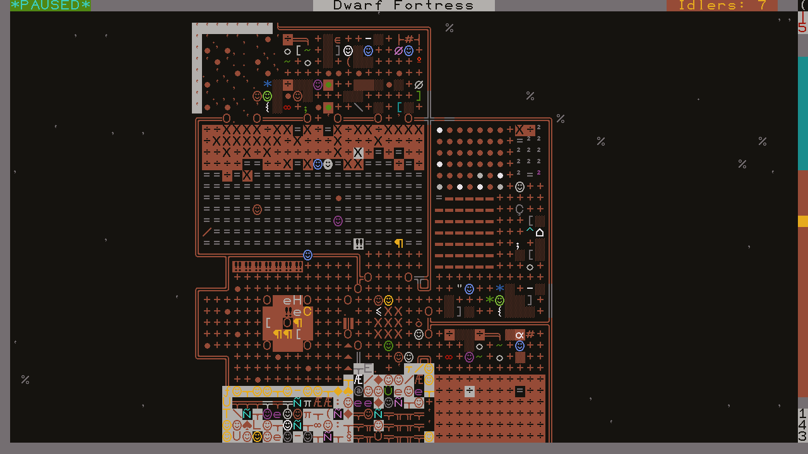
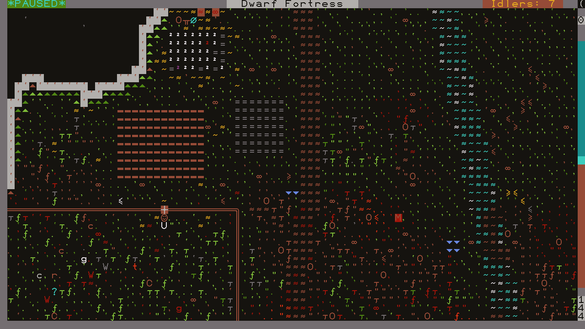
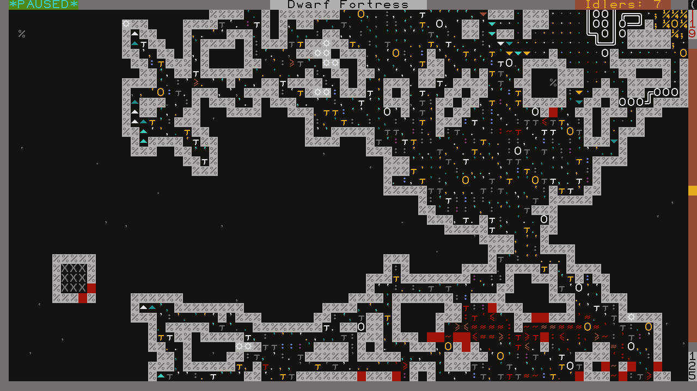
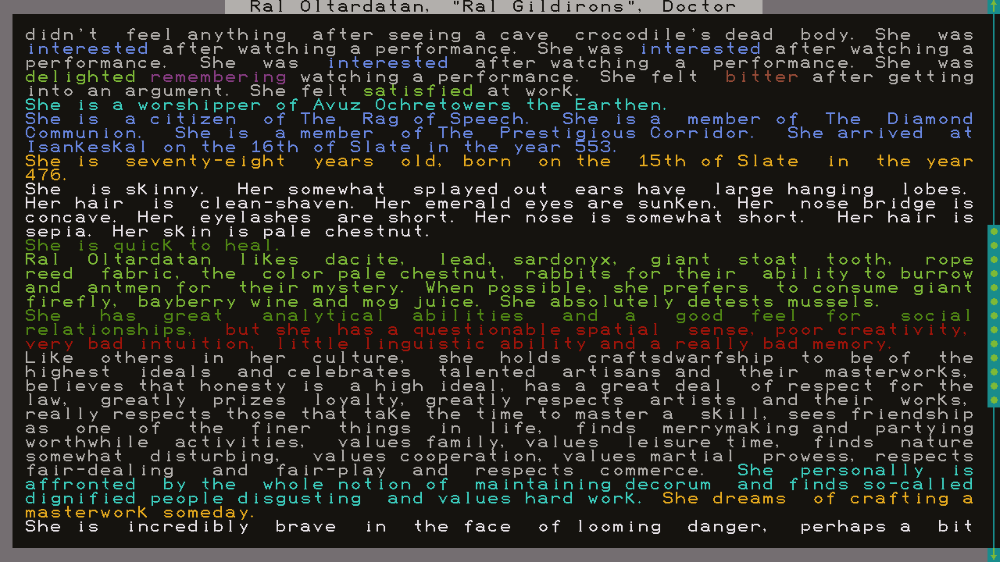

# cogp47

**Cogwheel's CP47 font**

Late last century, in a fit of boerdom during high school, I hand-drew a DOS code page 47 font thinking I'd use it in a game. I never got around to making that game, but I did start playing dwarf fortress recently. Not quite happy with any of the tilesets I found, I remembered stumbling across my old font in an archive. It only took a couple seconds to crop the margins and change the colors, and it worked! Not only that, I liked the way it looked.

## Video-friendly

By sheer coincidence, the 16x18 size I chose at the time is perfect for 16:9 video. Just set your window size to a 2:1 ratio (80x40, 140x70, etc.) and it will fit.

## Variants

### cogp47

The original font I drew in 1999 with MS Paint on Windows 95.

### cogp47\_v2

While I think it aged pretty well overall, there were a few tweaks to make here and there (I've learned a lot about typography and math since then). 

- Solid bullets (`\x07` and `\x08`) are now the same size as hollow bullets (`\x09` and `\x0A`)
- Made `p`, `q`, `b`, `d` more consistent with themselves and the rest of the letters.
- Moved underscore (`_`) up a pixel to make it visible within a block of background color
- Vertically centered the horizontal line-drawing components; single-line pieces line up with the gap between double-line pieces
- Cleaned up some math and greek symbols

### cogp47\_v2\_rounded

Added a bit of rounding to the line drawing characters.

### cogp47\_v2\_rounded\_small\_dots

Reduced the size of `.`, `,`, `'`, `` ` ``, and `\xFA` to make things stand out from the background more in Dwarf Fortress.

| cogp47\_v2\_rounded\_small\_dots samples |
|----|
|  |
|  |
|  |
|  |

## License

These files are released under the CC0 license. See [LICENSE](LICENSE) for details.
